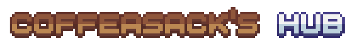

  

---

> [!WARNING]
> Profile under construction.

  

Born in Brazil, São Paulo, I grew up thinking about new ways to express myself. In my life, everything I could do to let me creativity out I would do, be it drawing, writing, painting, filming, crocheting or any "ing" that you can imagine (Or maybe not?). Currently i'm learning to express myself through programming languages. **I want to become a frontend developer** since they have the most action regarding artistic choices and whatnot, but mostly to learn and grow in the field and make a career in it. My future website will have a portfolio where you'll be able to see all my drawings and artistic byproducts, so check it out when it's out!

  

As of the time of writing, my current skills in technologies, ordered from "most confident" to "want to learn" is CSS, as I love design and colors; HTML, since it's needed to provide accessability I gave it a lot of attention; Python, since it was my "starting 
point" on backend studies; JS, for it's use on making my designs interactive; React, as I used it to learn more about fast structuring of webpages (Not quite there yet, but, still, I've learned a lot!); and Typescript, as an attempt to work better with Javascript. 

  
**Regarding technologies that I know and want to improve on:**

**Regarding technologies that I want to learn and improve on:**

"Lorem ipsum dolor sit amet, consectetur adipiscing elit, sed do eiusmod tempor incididunt ut labore et dolore magna aliqua. Ut enim ad minim veniam, quis nostrud exercitation ullamco laboris nisi ut aliquip ex ea commodo consequat. Duis aute irure dolor in reprehenderit in voluptate velit esse cillum dolore eu fugiat nulla pariatur. Excepteur sint occaecat cupidatat non proident, sunt in culpa qui officia deserunt mollit anim id est laborum."
<!--
**coffeasack/coffeasack** is a ✨ _special_ ✨ repository because its `README.md` (this file) appears on your GitHub profile.

Here are some ideas to get you started:

- 🔭 I’m currently working on ...
- 🌱 I’m currently learning ...
- 👯 I’m looking to collaborate on ...
- 🤔 I’m looking for help with ...
- 💬 Ask me about ...
- 📫 How to reach me: 
- 😄 Pronouns: 
- ⚡ Fun fact: N
-->
